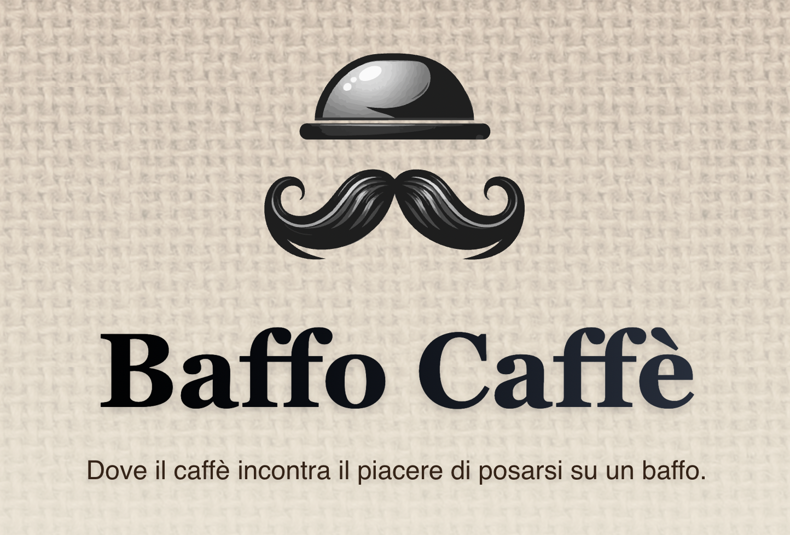

<div align="center">
  <a href="https://baffocaffe.rasna.dev" target="_blank">
    
  </a>
  
  **[🌐 View Live Site](https://baffocaffe.rasna.dev)**
</div>

Il sito web ufficiale di **Baffo Caffè**, il negozio di capsule caffè ad Alfonsine. Un'esperienza digitale che riflette la passione per il caffè di qualità e l'attenzione al servizio clienti.

## ✨ Caratteristiche

- 🎨 **Design Responsivo**: Ottimizzato per tutti i dispositivi
- ☕ **Tema Coffee-Inspired**: Palette di colori ispirata al mondo del caffè
- 🚀 **Performance Ottimizzate**: Built with Next.js 15 e TypeScript
- 📱 **Mobile-First**: Esperienza utente perfetta su mobile
- 🎯 **SEO Ottimizzato**: Meta tags e structured data per la visibilità online
- 🌟 **Animazioni Fluide**: Micro-interazioni e animazioni CSS personalizzate

## 🛠️ Tecnologie Utilizzate

- **Framework**: Next.js 15 (App Router)
- **Linguaggio**: TypeScript
- **Styling**: Tailwind CSS
- **UI Components**: Radix UI + shadcn/ui
- **Icone**: Lucide React
- **Deployment**: GitHub Pages

## 🚀 Sviluppo Locale

### Prerequisiti
- Node.js 18+ 
- pnpm (raccomandato) o npm

### Installazione

1. **Clona il repository**
   ```bash
   git clone https://github.com/your-username/baffocaffe.git
   cd baffocaffe
   ```

2. **Installa le dipendenze**
   ```bash
   pnpm install
   # oppure
   npm install
   ```

3. **Avvia il server di sviluppo**
   ```bash
   pnpm dev
   # oppure
   npm run dev
   ```

4. **Apri il browser**
   
   Vai su [http://localhost:3000](http://localhost:3000) per vedere il sito in azione.

### Comandi Disponibili

```bash
pnpm dev          # Avvia il server di sviluppo
pnpm build        # Build per la produzione
pnpm start        # Avvia il server di produzione
pnpm lint         # Esegue ESLint
pnpm type-check   # Controllo TypeScript
```

## 📁 Struttura del Progetto

```
src/
├── app/                 # App Router (Next.js 15)
│   ├── globals.css     # Stili globali e variabili CSS
│   ├── layout.tsx      # Layout principale e metadata
│   └── page.tsx        # Homepage
├── components/         # Componenti React
│   ├── ui/            # Componenti UI base (shadcn/ui)
│   ├── HeroSection.tsx
│   ├── StorySection.tsx
│   ├── ContactSection.tsx
│   └── Logo.tsx
└── config/
    └── site.ts        # Configurazione centralizzata del sito
```

## 🌐 Deployment

Il sito è deployato su **GitHub Pages** con deployment automatico tramite GitHub Actions.

- **URL Produzione**: [baffocaffe.rasna.dev](https://baffocaffe.rasna.dev)
- **Deploy automatico**: Ogni push su `main` triggera un nuovo deploy
- **Static Export**: Next.js configurato per export statico (`output: 'export'`)

### Configurazione GitHub Pages

Il progetto include:
- `.github/workflows/deploy.yml` per il deployment automatico
- `next.config.ts` configurato per static export
- Build ottimizzato per hosting statico

## 📞 Contatti

**Baffo Caffè**
- 📍 Via Ventottesima Brigata Garibaldi 6, 48011 Alfonsine (RA)
- 📞 [+39 342 342 5920](tel:+393423425920)
- 📧 [info@baffocaffe.it](mailto:info@baffocaffe.it)
- 💬 [WhatsApp](https://wa.me/393423425920)

## 📄 Licenza

Questo progetto è proprietà di Baffo Caffè. Tutti i diritti riservati.
